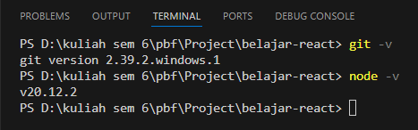
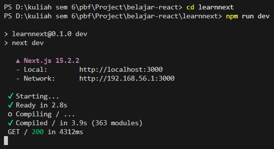
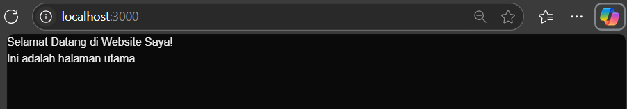
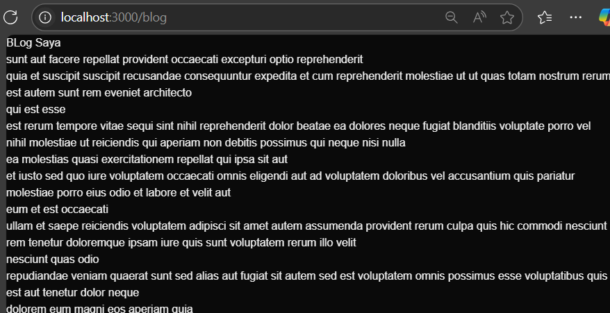
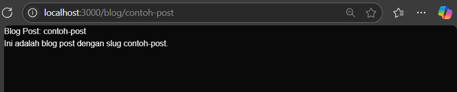
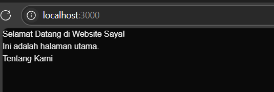
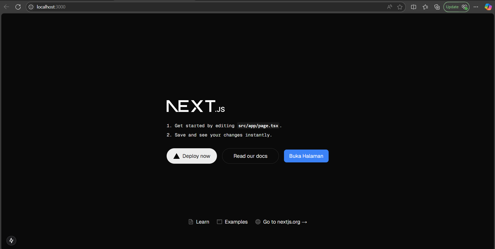
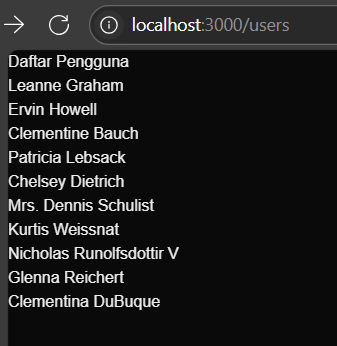
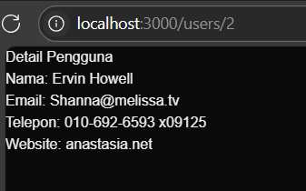

# pemrograman-berbasis-framework-2025

2241720131 - Mulki Hakim - Pemrograman Berbasis Framework 2025

# <center>Laporan Praktikum

|       | Pemrograman Berbasi Framework 2025 |
| ----- | ---------------------------------- |
| NIM   | 2241720131                         |
| Nama  | Mulki Hakim                        |
| Kelas | TI-3A                              |

## <center>Pengenalan NextJs

### A. Persiapan Lingkungan




### B. Membuat Halaman dengan Server-Side Rendering (SSR)

* ganti kode pada file pages/index.tsx
```typescript
import React from "react";

const HomePage = () => {
  return (
    <div>
      <h1>Selamat Datang di Website Saya!</h1>
      <p>Ini adalah halaman utama.</p>
    </div>
  );
};

export default HomePage;

```
output:


### C. Menggunakan Statis Site Generation (SSG)

buat file baru di folder pages dengan nama blog.js

```javascript
import React from 'react';

const Blog = ({ posts }) => {
    return (
        <div>
            <h1>BLog Saya</h1>
            {posts.map((post) => (
                <div key={post.id}>
                    <h2>{post.title}</h2>
                    <p>{post.body}</p>
                </div>
            ))}
        </div>
    );
};

export async function getStaticProps() {
    const res = await fetch('https://jsonplaceholder.typicode.com/posts');
    const posts = await res.json();

    return {
        props: {
            posts,
        },
    };
}

export default Blog;
```

output: 


### D. Menggunakan Dynamic Routes

buat folder blog di dalam folder pages, lalu buat file [slug].js di dalam folder blog:

```javascript
import { useRouter } from 'next/router';

const  BlogPost = () => {
    const router = useRouter();
    const { slug } = router.query;

    return (
        <div>
            <h1>Blog Post: {slug}</h1>
            <p>Ini adalah blog post dengan slug {slug}.</p>
        </div>
    );
};

export default BlogPost;
```

output:


### E. Menggunakan API Routes

* buat file product.js di dalam folder api
```javascript
export default async function handler(req, res) {
    const response = await fetch('https://fakestoreapi.com/products');
    const products = await response.json();

    res.status(200).json(products);
}
```
* buat file products.js di dalam folder pages
```javascript
import { useState, useEffect } from "react";

const ProductList = () => {
    const [products, setProducts] = useState([]);

    useEffect(() => {
        const fetchProducts = async () => {
            const response = await fetch('/api/products');
            const products = await response.json();
            setProducts(products);
        };

        fetchProducts(products);
    }, []);

    return (
        <div>
            <h1>Daftar Produk</h1>
            <ul>
                {products.map((product) => (
                    <li key={product.id}>{product.title}</li>
                ))}
            </ul>
        </div>
    );
};

export default ProductList;
```

output:


### F. Menggunakan Link Component

* buka file pages/index.tsx dan buat link ke halaman lain
```typescript
import Link from "next/link";

const HomePage = () => {
  return (
    <div>
      <h1>Selamat Datang di Website Saya!</h1>
      <p>Ini adalah halaman utama.</p>
      <Link href="/about">Tentang Kami</Link>
    </div>
  );
};

export default HomePage;
```
* buat file about.js di dalam foldr pages
```javascript
const AboutPage = () => {
    return (
        <div>
            <h1>Tentang Kami</h1>
            <p>Kami adalah perusahaan yang mengkhususkan diri dalam pembuatan website berkualitas tinggi.</p>
        </div>
    );
};

export default AboutPage;
```

output:

saat klik link "Tentang Kami":


## Tugas 
1. Buat halaman baru dengan menggunakan Static Site Generation (SSG) yang menampilkan daftar 
pengguna dari API https://jsonplaceholder.typicode.com/users. 

    jawab:

    buat file pages/users/index.js
    ```javascript
    const UsersPage = ({ users }) => {
        return (
        <div>
            <h1>Daftar Pengguna</h1>
            <ul>
            {users.map((user) => (
                <li key={user.id}>
                <a href={`/users/${user.id}`}>{user.name}</a>
                </li>
            ))}
            </ul>
        </div>
        );
    };
    
    export async function getStaticProps() {
        // Ambil data dari API menggunakan fetch
        const res = await fetch("https://jsonplaceholder.typicode.com/users");
        const users = await res.json();
    
        return {
        props: {
            users,
        },
        };
    }
    
    export default UsersPage;
    ```

    output:

    

2. Implementasikan Dynamic Routes untuk menampilkan detail pengguna berdasarkan ID. 

    jawab:

    buat file pages/users/[id].js
    ```javascript
    const UserDetail = ({ user }) => {
        return (
        <div>
            <h1>Detail Pengguna</h1>
            <p>Nama: {user.name}</p>
            <p>Email: {user.email}</p>
            <p>Telepon: {user.phone}</p>
            <p>Website: {user.website}</p>
        </div>
        );
    };
    
    export async function getStaticPaths() {
        // Ambil data pengguna untuk menghasilkan paths
        const res = await fetch("https://jsonplaceholder.typicode.com/users");
        const users = await res.json();
    
        // Buat paths berdasarkan ID pengguna
        const paths = users.map((user) => ({
        params: { id: user.id.toString() },
        }));
    
        return {
        paths,
        fallback: false, // Tampilkan 404 jika path tidak ditemukan
        };
    }
    
    export async function getStaticProps({ params }) {
        // Ambil detail pengguna berdasarkan ID
        const res = await fetch(
        `https://jsonplaceholder.typicode.com/users/${params.id}`
        );
        const user = await res.json();
    
        return {
        props: {
            user,
        },
        };
    }
    
    export default UserDetail;
    ```

    output:

    

3. Buat API route yang mengembalikan data cuaca dari API eksternal (misalnya, 
OpenWeatherMap) dan tampilkan data tersebut di halaman front-end.