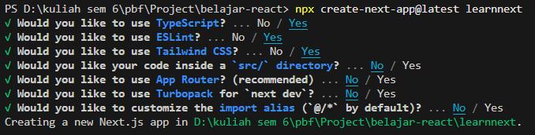
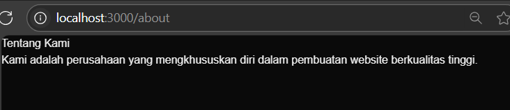

# pemrograman-berbasis-framework-2025

2241720131 - Mulki Hakim - Pemrograman Berbasis Framework 2025

# <center>Laporan Praktikum

|       | Pemrograman Berbasi Framework 2025 |
| ----- | ---------------------------------- |
| NIM   | 2241720131                         |
| Nama  | Mulki Hakim                        |
| Kelas | TI-3A                              |

## <center>REACTJS

### 1: Persiapan Lingkungan




### 2: Membuat Komponen React

edit kode pada file src/App.js

```javascript
import React from "react";

// Komponen Header
function Header() {
  return (
    <header>
      <h1>Aplikasi React Saya</h1>
    </header>
  );
}

// Komponen Main
function Main() {
  return (
    <main>
      <h2>Selamat data di APlikasi React Saya</h2>
      <p>Ini adalah area konten utama</p>
    </main>
  );
}

// Komponen Footer
function Footer() {
  return (
    <footer>
      <p>&copy; 2025 Aplikasi React Saya</p>
    </footer>
  );
}
// Komponen App yang menggunakan Header, Main, dan Footer
function App() {
  return (
    <div>
      <Header />
      <Main />
      <Footer />
    </div>
  );
}

export default App;
```


### 3: Menggunakan JSX untuk Membuat Komponen Dinamis

file baru dengan nama Conter.js

```javascript
import React, { useState } from "react";

function Counter() {
  const [count, setCount] = useState(0);

  function handleClick() {
    setCount(count + 1);
  }

  return (
    <div>
      <h1>Hitungan: {count}</h1>
      <button onClick={handleClick}>Tambah</button>
    </div>
  );
}

export default Counter;
```

impor komponen Counter

```javascript
import Counter from "./Counter";
```


### 4: Menggunakan Props untuk Mengirim Data

buat file baru dengan nama Greeting.js

```javascript
function Greeting(props) {
  return <h1>Halo, {props.name}</h1>;
}

export default Greeting;
```

impor komponen Greeting dan tambahkan komponen Greeting ke dalam komponen App dan kirim props name


### 5: Menggunakan State untuk Mengelola Data


Tugas 
1. Buat komponen baru bernama TodoList yang menampilkan daftar tugas (todo list). Gunakan 
state untuk mengelola daftar tugas dan props untuk mengirim data tugas ke komponen anak. 
2. Tambahkan fitur untuk menambahkan tugas baru ke dalam daftar menggunakan form input. 
3. Implementasikan fitur untuk menghapus tugas dari daftar. 

jawab: 

```javascript
import React, { useState } from 'react';

function TodoList() {
  const [todos, setTodos] = useState([]);
  const [newTodo, setNewTodo] = useState('');

  const addTodo = () => {
    if (newTodo.trim() !== '') {
      setTodos([...todos, { id: Date.now(), text: newTodo }]);
      setNewTodo('');
    }
  };

  const removeTodo = (id) => {
    setTodos(todos.filter(todo => todo.id !== id));
  };

  return (
    <div>
      <h1>Todo List</h1>
      <input
        type="text"
        value={newTodo}
        onChange={(e) => setNewTodo(e.target.value)}
        placeholder="Add a new task"
      />
      <button onClick={addTodo}>Add</button>
      <ul>
        {todos.map(todo => (
          <TodoItem key={todo.id} todo={todo} removeTodo={removeTodo} />
        ))}
      </ul>
    </div>
  );
}

function TodoItem({ todo, removeTodo }) {
  return (
    <li>
      {todo.text}
      <button onClick={() => removeTodo(todo.id)}>Remove</button>
    </li>
  );
}

export default TodoList;
```

ouput: 

