# <center>Laporan Praktikum

|   | Pemrograman Berbasi Framework 2025 |
|---|---|
|NIM|2241720131|
|Nama|Mulki Hakim|
|Kelas|TI-3A|

## <center>PENGANTAR PEMROGRAMAN BERBASIS FRAMEWORK DAN REACTJS

### Praktikum 1: Menyiapkan Lingkungan Pengembangan

Pertanyaan Praktikum 1
1. Jelaskan kegunaan masing-masing dari Git, VS Code dan NodeJS yang telah Anda install pada sesi praktikum ini! 

    jawab : 
    
    git untuk mengelola versi kode sumber dan memudahkan kolaborasi antar anggota tim dalam proyek pemrograman. VS Code untuk editor kode pada projek praktikum ini. NodeJS untuk lingkungan runtime untuk menjalankan kode JavaScript di luar browser, sering digunakan untuk pengembangan aplikasi web sisi server.

2. Buktikan dengan screenshoot yang menunjukkan bahwa masing-masing tools tersebut telah berhasil terinstall di perangkat Anda! 
    
    jawab : 

    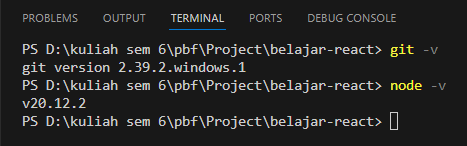

### Praktikum 2: Membuat Proyek Pertama React Menggunakan Next.js

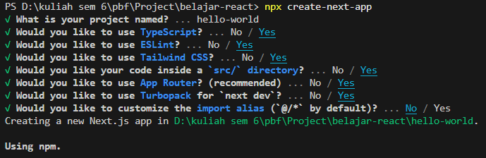
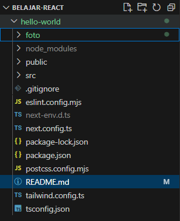
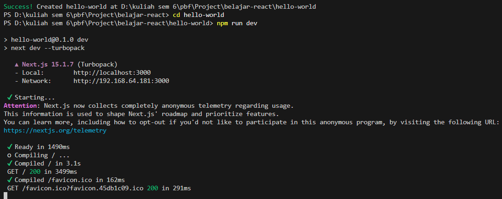
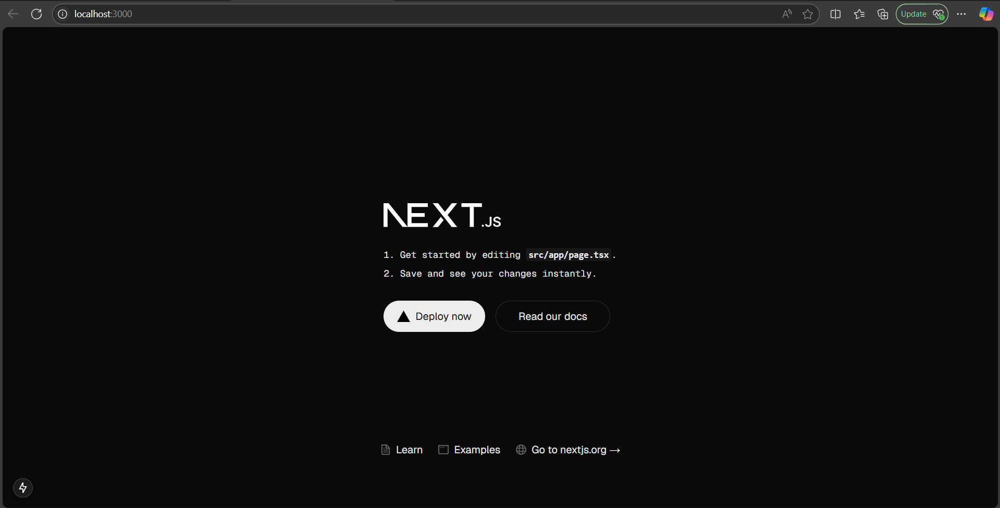

Pertanyaan Praktikum 2 
1. Pada Langkah ke-2, setelah membuat proyek baru menggunakan Next.js, terdapat beberapa istilah yang muncul. Jelaskan istilah tersebut, TypeScript, ESLint, Tailwind CSS, App Router, Import alias, App router, dan Turbopack! 

    jawab:

    - TypeScript: Sebuah superset dari JavaScript yang menambahkan tipe statis. TypeScript membantu mencegah kesalahan dan membuat kode lebih mudah dipahami dan dikelola.
    - ESLint: Alat linter untuk JavaScript dan TypeScript yang membantu menemukan dan memperbaiki masalah pada kode. ESLint memastikan kode sesuai dengan standar yang ditentukan.
    - Tailwind CSS: Framework CSS yang menyediakan kelas-kelas utilitas siap pakai untuk membuat desain web yang responsif dan kustom. Tailwind memungkinkan untuk membangun UI secara cepat dan konsisten.
    - App Router: Sistem routing di Next.jsyang mengelola navigasi dan halaman dalam aplikasi. App Router mempermudah pembuatan rute dinamis dan penanganan permintaan URL.
    - Import alias: Fitur yang memungkinkan untuk menetapkan nama pendek untuk jalur impor modul. Ini membantu mengurangi kerumitan impor dengan jalur yang panjang dan meningkatkan keterbacaan kode.
    - Turbopack: Bundler baru yang dikembangkan oleh Vercel untuk menggantikan Webpack. Turbopack dirancang untuk lebih cepat dan efisien dalam mem-bundel aset proyek Next.js.

2. Apa saja kegunaan folder dan file yang ada pada struktur proyek React yang tampil pada gambar pada tahap percobaan ke-3! 

    jawab :

    - Folder .next: Folder ini biasanya dihasilkan secara otomatis oleh Next.jsdan berisi file build dan cache yang diperlukan untuk menjalankan aplikasi Next.js.
    - Folder node_modules: Folder ini berisi semua dependensi atau paket yang diinstal melalui npm atau yarn yang diperlukan untuk menjalankan proyek.
    - Folder public: Folder ini digunakan untuk menyimpan aset statis seperti gambar, ikon, dan file lainnya yang dapat diakses secara langsung oleh browser.
    - Folder src/app: Folder ini berisi file sumber utama dari aplikasi. Di dalamnya terdapat:
        - favicon.ico: Ikon kecil yang muncul di tab browser.
        - globals.css: File CSS global yang berisi gaya yang diterapkan ke seluruh aplikasi.
        - layout.tsx: File komponen layout yang mungkin digunakan untuk menentukan tata letak umum dari halaman.
        - page.tsx: File komponen halaman yang mungkin digunakan untuk menentukan konten dari halaman tertentu.
    - File .gitignore: File ini berisi daftar file dan folder yang harus diabaikan oleh Git saat melakukan commit.
    - File .eslintrc.json: File konfigurasi untuk ESLint, alat yang digunakan untuk menemukan dan memperbaiki masalah dalam kode JavaScript.
    - File next-env.d.ts: File deklarasi TypeScript yang dihasilkan secara otomatis oleh Next.jsuntuk mendukung TypeScript.
    - File next.config.js: File konfigurasi untuk Next.jsyang memungkinkan pengaturan khusus untuk aplikasi Next.js.
    - File package-lock.json: File ini dihasilkan secara otomatis oleh npm dan berisi informasi tentang versi spesifik dari setiap paket yang diinstal, memastikan bahwa instalasi di masa depan konsisten.
    - File package.json: File ini berisi metadata tentang proyek dan daftar dependensi yang diperlukan untuk menjalankan proyek.
    - File postcss.config.js: File konfigurasi untuk PostCSS, alat yang digunakan untuk memproses CSS dengan plugin JavaScript.
    - File README.md: File ini biasanya berisi dokumentasi atau informasi penting tentang proyek.
    - File tailwind.config.ts: File konfigurasi untuk Tailwind CSS, framework CSS yang digunakan untuk mendesain antarmuka pengguna.
    - File tsconfig.json: File konfigurasi untuk TypeScript yang menentukan bagaimana proyek TypeScript harus dikompilasi.
    
3. Buktikan dengan screenshoot yang menunjukkan bahwa tahapan percobaan di atas telah 
berhasil Anda lakukan!

### Praktikum 3: Menambahkan Komponen React (Button)

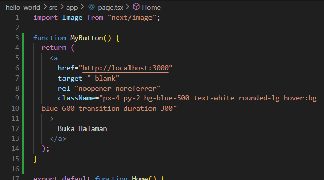
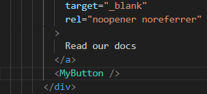
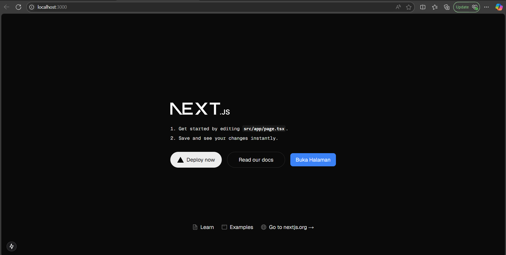

Pertanyaan Praktikum 3 
1. Buktikan dengan screenshoot yang menunjukkan bahwa tahapan percobaan di atas telah 
berhasil Anda lakukan! 

### Praktikum 4: Menulis Markup dengan JSX

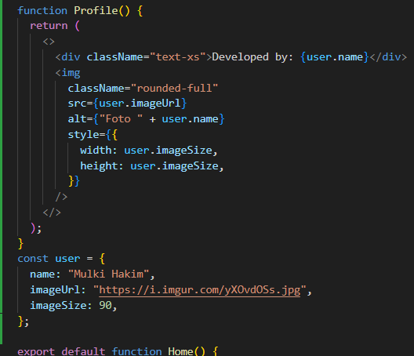
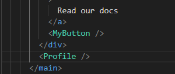
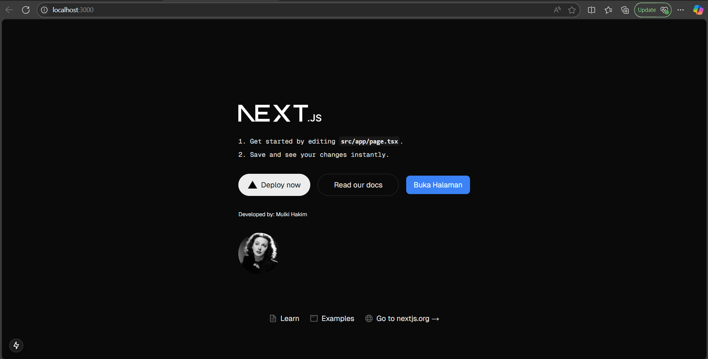

Pertanyaan Praktikum 4 
1. Untuk apakah kegunaan sintaks user.imageUrl? 

    jawab:

    Sintaks user.imageUrl digunakan untuk menentukan sumber (URL) gambar yang akan ditampilkan oleh elemen . Properti src pada elemen  diisi dengan nilai imageUrl dari objek user, yang telah didefinisikan sebelumnya. Dengan demikian, gambar yang ditampilkan pada halaman akan berasal dari URL yang tersimpan dalam user.imageUrl.

2. Buktikan dengan screenshoot yang menunjukkan bahwa tahapan percobaan di atas telah 
berhasil Anda lakukan!

-----

This is a [Next.js](https://nextjs.org) project bootstrapped with [`create-next-app`](https://nextjs.org/docs/app/api-reference/cli/create-next-app).

## Getting Started

First, run the development server:

```bash
npm run dev
# or
yarn dev
# or
pnpm dev
# or
bun dev
```

Open [http://localhost:3000](http://localhost:3000) with your browser to see the result.

You can start editing the page by modifying `app/page.tsx`. The page auto-updates as you edit the file.

This project uses [`next/font`](https://nextjs.org/docs/app/building-your-application/optimizing/fonts) to automatically optimize and load [Geist](https://vercel.com/font), a new font family for Vercel.

## Learn More

To learn more about Next.js, take a look at the following resources:

- [Next.js Documentation](https://nextjs.org/docs) - learn about Next.js features and API.
- [Learn Next.js](https://nextjs.org/learn) - an interactive Next.js tutorial.

You can check out [the Next.js GitHub repository](https://github.com/vercel/next.js) - your feedback and contributions are welcome!

## Deploy on Vercel

The easiest way to deploy your Next.js app is to use the [Vercel Platform](https://vercel.com/new?utm_medium=default-template&filter=next.js&utm_source=create-next-app&utm_campaign=create-next-app-readme) from the creators of Next.js.

Check out our [Next.js deployment documentation](https://nextjs.org/docs/app/building-your-application/deploying) for more details.
